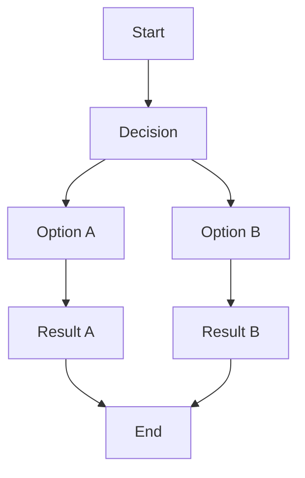

Here is a sample of some basic Markdown syntax that can be used when writing Markdown content.

## Headings

The following HTML `<h1>`–`<h6>` elements represent six levels of section headings.
`<h1>` is the highest section level while `<h6>` is the lowest.

# H1 <!-- rumdl-disable-line single-title -->

## H2

### H3

#### H4

##### H5

###### H6

## Paragraph

<!-- vale off -->
Xerum, quo qui aut unt expliquam qui dolut labo.
Aque venitatiusda cum, voluptionse latur sitiae dolessi aut parist aut dollo enim qui voluptate ma dolestendit peritin re plis aut quas inctum laceat est volestemque commosa as cus endigna tectur, offic to cor sequas etum rerum idem sintibus eiur?
Quianimin porecus [evelectur](/), cum que nis nust voloribus ratem aut omnimi, sitatur?
Quiatem.
Nam, omnis sum am facea corem alique molestrunt et eos evelece arcillit ut aut eos eos nus, sin conecerem erum fuga.
Ri oditatquam, ad quibus unda veliamenimin cusam et facea ipsamus es exerum sitate dolores editium rerore eost, temped molorro ratiae volorro te reribus dolorer sperchicium faceata tiustia prat.

Itatur?
Quiatae cullecum rem ent aut odis in re eossequodi nonsequ idebis ne sapicia is sinveli squiatum, core et que aut hariosam ex eat.
<!-- vale on -->

## Images

### Syntax

```markdown

```

### Output


## Block quotes

The block quote element represents content that's quoted from another source, optionally with a citation which must be within a `footer` or `cite` element, and optionally with in-line changes such as annotations and abbreviations.

### Block quote without attribution

#### Syntax

```markdown
> Tiam, ad mint andaepu dandae nostion secatur sequo quae.
> **Note** that you can use _Markdown syntax_ within a blockquote.
```

#### Output

<!-- vale off -->
> Tiam, ad mint andaepu dandae nostion secatur sequo quae.
> **Note** that you can use _Markdown syntax_ within a block quote.
<!-- vale on -->

### Block quote with attribution

End the quote with a paragraph that starts with an em dash; it renders as the quote's `footer`.
Wrap a work title in `<cite>`, never a person's name.

#### Syntax

```markdown
> Don't communicate by sharing memory, share memory by communicating.
>
> — Rob Pike, <cite>Go Proverbs</cite>[^1]
```

#### Output

<!-- rumdl-disable no-inline-html -->
> Don't communicate by sharing memory, share memory by communicating.
>
> — Rob Pike, <cite>Go Proverbs</cite>[^1]
<!-- rumdl-enable no-inline-html -->

[^1]: The above quote is excerpted from Rob Pike's [talk](https://www.youtube.com/watch?v=PAAkCSZUG1c) during Gopherfest, November 18, 2015.

## Tables

### Syntax

```markdown
| Italics   | Bold     | Code   |
| --------- | -------- | ------ |
| _italics_ | **bold** | `code` |
```

### Output

| Italics   | Bold     | Code   |
| --------- | -------- | ------ |
| _italics_ | **bold** | `code` |

## Code Blocks

### Syntax

we can use 3 backticks ``` in new line and write snippet and close with 3 backticks on new line and to highlight language specific syntax, write one word of language name after first 3 backticks, for eg. html, javascript, css, markdown, typescript, txt, bash

````markdown
```html
<!doctype html>
<html lang="en">
  <head>
    <meta charset="utf-8" />
    <title>Example HTML5 Document</title>
  </head>
  <body>
    <p>Test</p>
  </body>
</html>
```
````

### Output

```html
<!doctype html>
<html lang="en">
  <head>
    <meta charset="utf-8" />
    <title>Example HTML5 Document</title>
  </head>
  <body>
    <p>Test</p>
  </body>
</html>
```

### Mermaid



## List Types

### Ordered List

#### Syntax

```markdown
1. First item
2. Second item
3. Third item
```

#### Output

1. First item
2. Second item
3. Third item

### Unordered List

#### Syntax

```markdown
- List item
- Another item
- And another item
```

#### Output

- List item
- Another item
- And another item

### Nested list

#### Syntax

```markdown
- Fruit
  - Apple
  - Orange
  - Banana
- Dairy
  - Milk
  - Cheese
```

#### Output

- Fruit
  - Apple
  - Orange
  - Banana
- Dairy
  - Milk
  - Cheese

### Task Lists

```markdown
- [ ] Todo
- [x] Done
```

#### Output

- [ ] Todo
- [x] Done

## Other Elements — abbr, sub, sup, kbd, mark

### Syntax

```markdown
<abbr title="Graphics Interchange Format">GIF</abbr> is a bitmap image format.

H<sub>2</sub>O

X<sup>n</sup> + Y<sup>n</sup> = Z<sup>n</sup>

Press <kbd>CTRL</kbd> + <kbd>ALT</kbd> + <kbd>Delete</kbd> to end the session.

Most <mark>salamanders</mark> are nocturnal, and hunt for insects, worms, and other small creatures.
```

### Output

<!-- rumdl-disable no-inline-html -->
<abbr title="Graphics Interchange Format">GIF</abbr> is a bitmap image format.

H<sub>2</sub>O

X<sup>n</sup> + Y<sup>n</sup> = Z<sup>n</sup>

Press <kbd>CTRL</kbd> + <kbd>ALT</kbd> + <kbd>Delete</kbd> to end the session.

Most <mark>salamanders</mark> are nocturnal, and hunt for insects, worms, and other small creatures.
<!-- rumdl-enable no-inline-html -->

---

You can also ~~strike through~~ text to indicate a correction.

## Callouts

> [!note] This is a _non-collapsible_ callout
> Some content is displayed directly!

> [!WARNING]- This is a **collapsible** callout
> Some content shown after opening!
